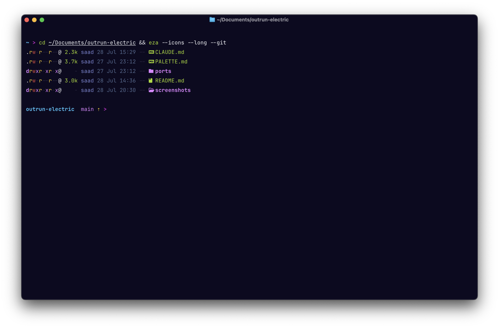
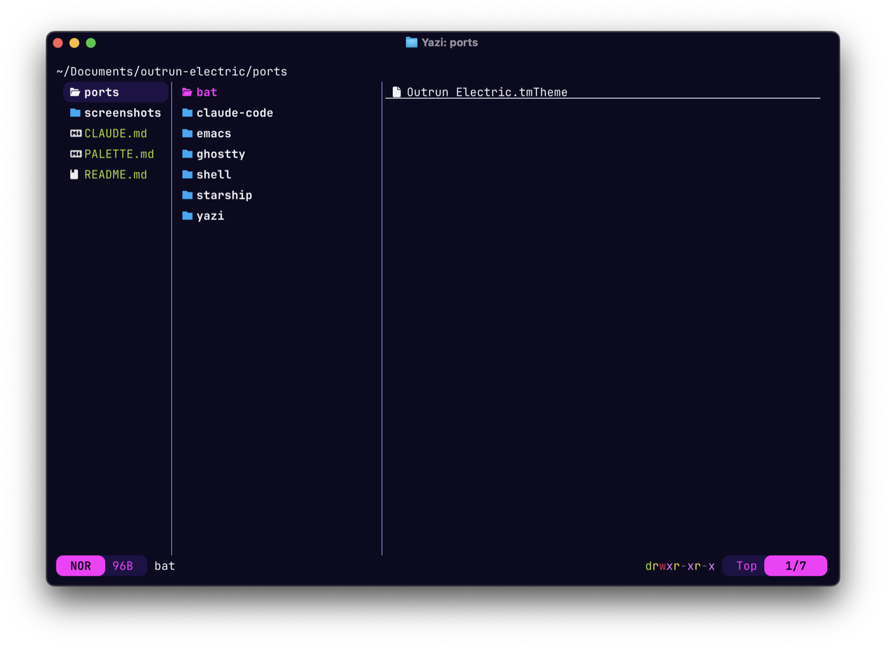
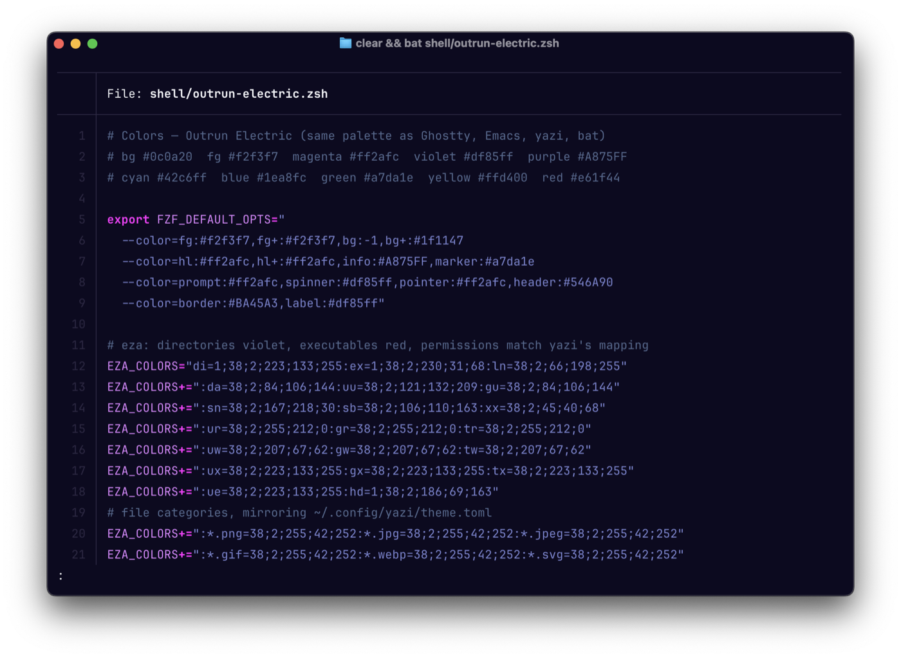
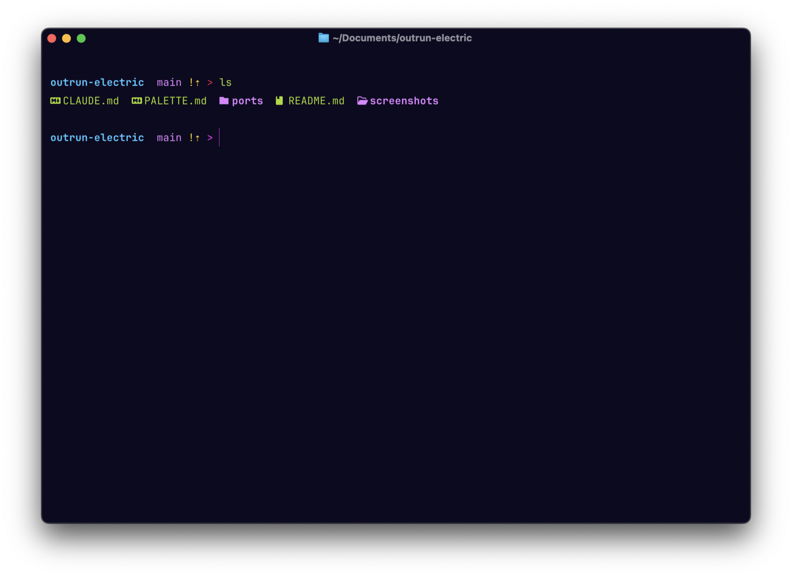
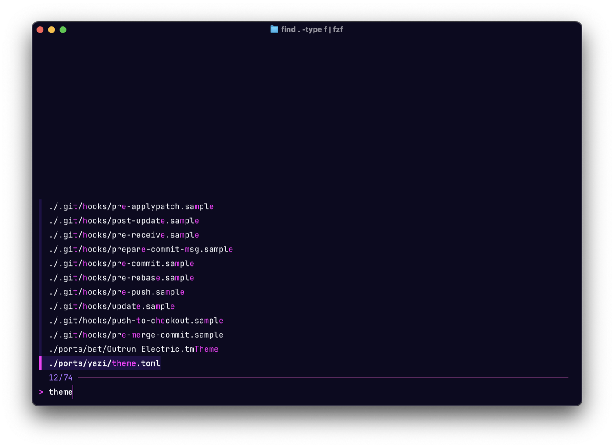
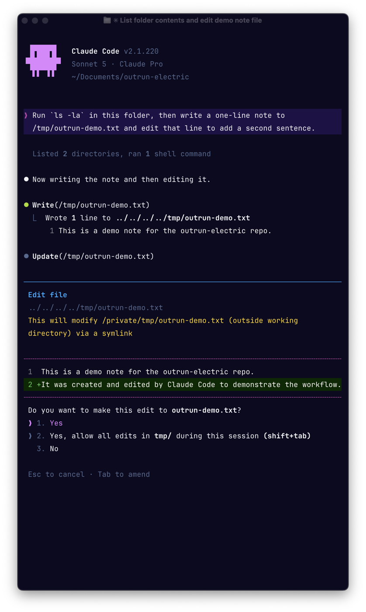

# Outrun Electric

A high-contrast neon synthwave palette, and ports of it to the applications
that did not have one.

Outrun Electric was created by [samrap](https://github.com/samrap/outrun-theme-vscode)
as a variant of the Outrun theme for VS Code. The palette used here follows
[ema2159](https://github.com/doomemacs/themes/blob/master/themes/doom-outrun-electric-theme.el)'s
Doom Emacs port, which is the fullest written-down form of it.

This is an unofficial community collection. It is not affiliated with either
upstream project.

**[PALETTE.md](PALETTE.md)** is the canonical colour specification — the named
values, the ANSI mapping, and guidance on assigning them when porting to a new
application.

## Screenshots

| | |
|---|---|
| [Ghostty](ports/ghostty/) | [yazi](ports/yazi/) |
|  |  |
| [bat](ports/bat/) | [starship](ports/starship/) |
|  |  |
| [fzf + eza](ports/shell/) | [Claude Code](ports/claude-code/) |
|  |  |

## Ports in this repo

| Application | Path | Install |
|---|---|---|
| Ghostty | [`ports/ghostty/`](ports/ghostty/) | Copy to `~/.config/ghostty/themes/`, then `theme = outrun-electric` |
| yazi | [`ports/yazi/`](ports/yazi/) | Copy to `~/.config/yazi/theme.toml` |
| Claude Code | [`ports/claude-code/`](ports/claude-code/) | Copy to `~/.claude/themes/`, then `/theme` |
| Pi | [`ports/pi/`](ports/pi/) | Copy to `~/.pi/agent/themes/`, then `/settings` → Theme |
| bat | [`ports/bat/`](ports/bat/) | Copy to `~/.config/bat/themes/`, run `bat cache --build`, set `--theme="Outrun Electric"` |
| starship | [`ports/starship/`](ports/starship/) | Palette block for `~/.config/starship.toml` |
| fzf + eza | [`ports/shell/`](ports/shell/) | Source from `.zshrc` |
| Chrome | [`ports/chrome/`](ports/chrome/) | `chrome://extensions` → Developer mode → Load unpacked |
| Brave (vertical tabs) | [`ports/brave/`](ports/brave/) | `chrome://extensions` → Developer mode → Load unpacked; see README for the new-tab background step |
| Firefox | [`ports/firefox/`](ports/firefox/) | `about:debugging` → Load Temporary Add-on; see its README for a permanent install and optional built-in-page colours |

## Ports elsewhere

| Application | Author | Link |
|---|---|---|
| VS Code | samrap | [outrun-theme-vscode](https://github.com/samrap/outrun-theme-vscode) |
| Sublime Text | samrap | [outrun-color-scheme-sublime](https://github.com/samrap/outrun-color-scheme-sublime) |
| Doom Emacs | ema2159 | [doomemacs/themes](https://github.com/doomemacs/themes/blob/master/themes/doom-outrun-electric-theme.el) |
| RStudio | JeffreyZammit | [Rstudio-outrun-theme](https://github.com/JeffreyZammit/Rstudio-outrun-theme) |
| Atom | StephKeys | [sweet-synthwave-syntax](https://github.com/StephKeys/sweet-synthwave-syntax) |
| iTerm2, kitty, Alacritty, WezTerm, Konsole, Windows Terminal, and ~30 others | sawtdakhili (contributed upstream) | [mbadolato/iTerm2-Color-Schemes](https://github.com/mbadolato/iTerm2-Color-Schemes) — [PR #730](https://github.com/mbadolato/iTerm2-Color-Schemes/pull/730), merged |

Only the ports in this repo are maintained here. The table above is a
convenience index — please raise issues with those authors, not here.

The iTerm2-Color-Schemes contribution reaches Ghostty's own bundled theme list
on their next weekly sync from that repo — check `ghostty +list-themes` to see
whether it has landed yet before pointing anyone to it as a Ghostty-native
option.

Beware that several popular themes describe themselves as "outrun inspired"
but use unrelated colour values, among them LaserWave, Synthwave '84 and
FluoroMachine. They will not match a terminal themed from this palette.

## Licence

MIT. The palette originates with the projects credited above.
